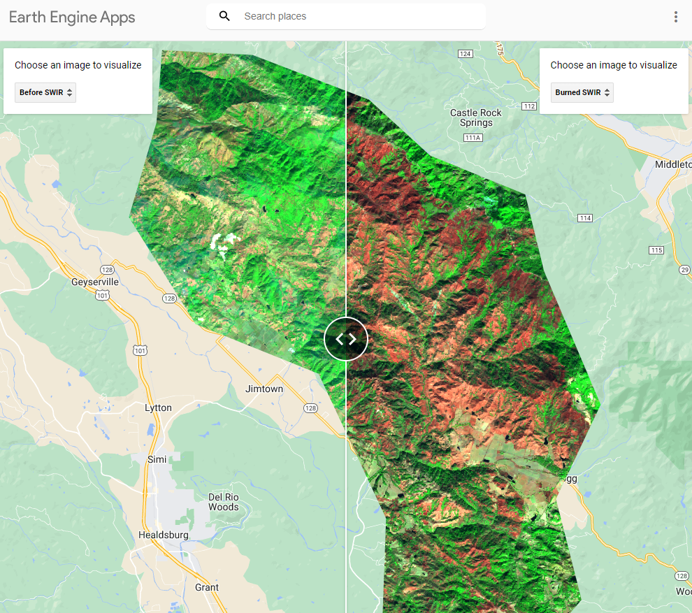

## Portfolio

---

### School Projects 

[7th at Shepherd](http://example.com/)

[Tony Morron Ownership](pdf/sample_presentation.pdf)

---
[Composite Image](/pdf/sample_presentation.pdf)

---
[Classification Example](http://example.com/)

---

### Class Projects
- 
- 
- [Project 3 Title](http://example.com/)
- [Project 4 Title](http://example.com/)

---

---

Page template forked from <a href="https://github.com/evanca/quick-portfolio">evanca</a>

<!-- Remove above link if you don't want to attibute -->
